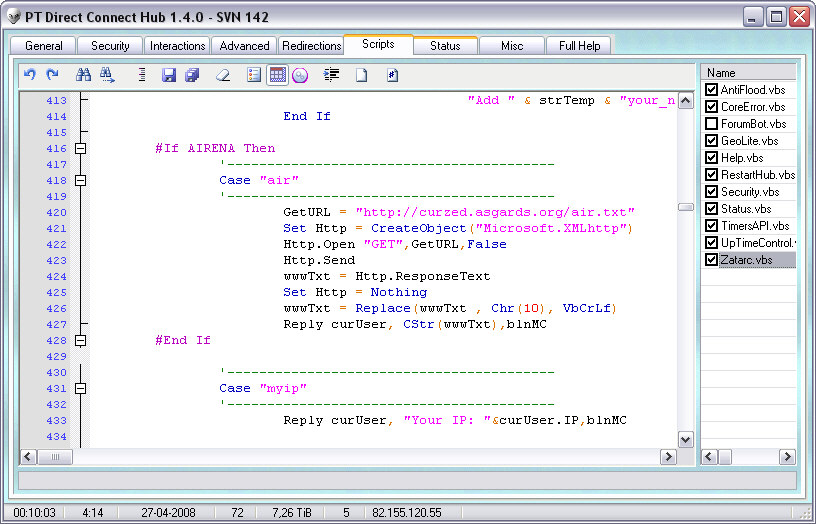



## PT DC Hub v1\.4\.0

### Description

PTDCH is a complete server-software for the Direct Connect P2P Network.

Use interface advanced by VBScripts or JScript with multiple API Events!

Supports plugins SDK with all API Hub Envents (demos included for VB6, VB 2005 and VB 2008!)

This new version is more optimizided!

Connection to MySQL or SQLite very easy to create in plugins or scripts..

Possivle load mutiples API Timer per script!

If you liked this work and live in Portugal (Braga), please contact me. I need job :)

I worked a long and hard for this project even so, about one year.. Enjoy!

Enjoy coding and don't forget to give feedback!
 
### More Info
 

             |
---                |---
**Submitted On**   |2008-04-26 23:08:58
**By**             |[fLaSh \- Carlos\.DF](https://github.com/Planet-Source-Code/PSCIndex/blob/master/ByAuthor/flash-carlos-df.md)
**Level**          |Advanced
**User Rating**    |5.0 (25 globes from 5 users)
**Compatibility**  |VB 6\.0, VB Script, VBA MS Access, VBA MS Excel
**Category**       |[Complete Applications](https://github.com/Planet-Source-Code/PSCIndex/blob/master/ByCategory/complete-applications__1-27.md)
**World**          |[Visual Basic](https://github.com/Planet-Source-Code/PSCIndex/blob/master/ByWorld/visual-basic.md)
**Archive File**   |[PT\_DC\_Hub\_2110884262008\.zip](https://github.com/Planet-Source-Code/flash-carlos-df-pt-dc-hub-v1-4-0__1-70465/archive/master.zip)

